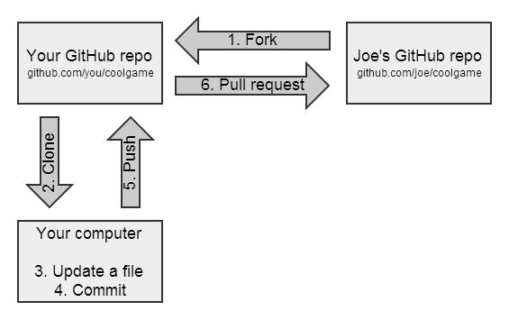

# Fork Command

### Forking Workflow


#### 把老师项目Fork到我的账户下，并保证master branch同步
1. Click the Fork button from the teacher's repo -> A project with the same name as Teacher's project should appear in my account
2. ```$ git clone https://github.com/MY_ACCOUNT_NAME/PROJECT_NAME.git```
3. Starting from Step 4, I am tring to 保证master branch同步
4. 跟上游仓库同步代码之前，必须配置过 remote，指向上游仓库。 Here 上游仓库 = Teacher's Repo  
```$ git remote add upstream https://github.com/ORIGINAL_OWNER/ORIGINAL_REPOSITORY.git```
5. 从上游仓库获取到分支，及相关的提交信息，它们将被保存在本地的 ```upstream/master``` 分支  
```$ git fetch upstream```
6. Switch my local repo's master branch  
```$ git checkout master```
7. Merge upstream's master into my local repo's master  
```$ git merge upstream/master```
8. If needed, I can push my local master branch to my remote repository  
```$ git push```


#### Tips
GitHub中，如果Pull Request是在我的repo点击，表示我要把别人的repo的比如master branch拉到我的repo来，而且这一定能实现因为我对我自己的repo有绝对的权限。  
如果Pull Request是在别人的repo点击，则为上图中的第6步，是希望别人（Joe）来拉我的修改。这不一定能实现，要看别人是否同意；他同意了也就实现了。

