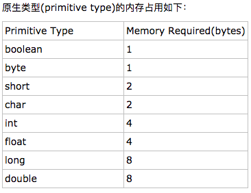

# Memory Usage

### Primitive Type
In Java, if I declare an int variable, it takes 4 bytes (disregarding the
  computer architecture).  



### Reference Type
Reference type is device dependent. A reference type object takes 4 bytes in
a 32-bit system and 8 bytes in a 64-bit system. [[1]]

### Array
In Java, array is realized as Object.  
If I declare  
```java
int[] arr = new int[N];
```
How much will it consume? [[1]]   
For a 32-bit machine, array's header consumes 8+4+4 = 16 bytes.
Then in total ```(16 + 4 * N)``` bytes.    
For a 64-bit machine, array's header consumes 16+4+4 = 24 bytes. ```(24 + 4 * N)``` bytes.  

Array has a starting address, and besides the 0th element, the following element
has address ```addr_0th + i * 4bytes```

### String Array
If I declare  
```java
String[] strArr = new String[N];
```
32-bit machine: ```(16 + 4 * N)``` bytes  
64-bit machine: ```(24 + 8 * N)``` bytes    
cuz String is reference type.  
In strArr, each element is initialized to null.  

### About Array's Header
My understanding of Array's header is from [[2]], which indicates in 64-bit machine,
> Array's header = 16 byte object overhead + 4 byte int length + 4 byte padding  

So I infer that for a 32-bit machine, array header consumption will be  
8 byte object overhead + 4 byte int length + 4 byte padding = 16 bytes  
Am I right?

### String Type
[3]


[1]: http://www.cnblogs.com/magialmoon/p/3757767.html
[2]: http://wwwiteye.iteye.com/blog/1985980
[3]: https://www.ibm.com/developerworks/cn/java/j-lo-optmizestring/
