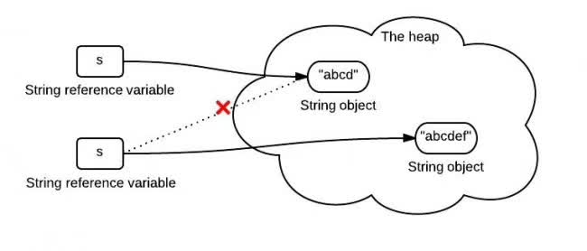

# String

### String, StringBuilder, StringBuffer
- If a string is going to remain constant throughout the program, then use String class object.  
- StringBuilder is single thread. If a string can change (example: lots of logic and operations in the construction of the string) and will only be accessed from a single thread, use StringBuilder.  
- StringBuffer is thread-safe. If a string can change, and will be accessed from multiple threads, use StringBuffer.  


### Immutability
```java
String s = "abcd";
s = s.concat("ef");
```


#### Why it is immutable?
Core Source Code  
```java
public final class String
	implements java.io.Serializable, Comparable<String>, CharSequence {
	/** The value is used for character storage */
	private final char value[];

	/** ... Note that use of this constructor is unnecessary since Strings are immutable */
	public String() {
		this.value = new char[0];
	}
}
```
Note: As you can see, String class is a final class, which cannot be inherited. And this class wrappers a ```char[]``` typed variable ```value```, meaning once ```value``` is initialized, it cannot be changed.  

This also tells us when initializing a String variable, using ```Sting s = "";``` is better than using ```String s = new String();``` cuz the prior way will not invoke the constructor in the String, reducing the redundancy.